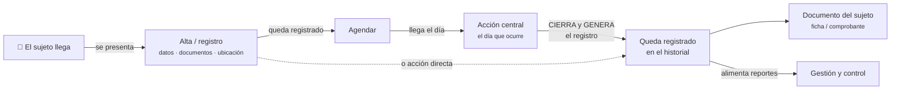
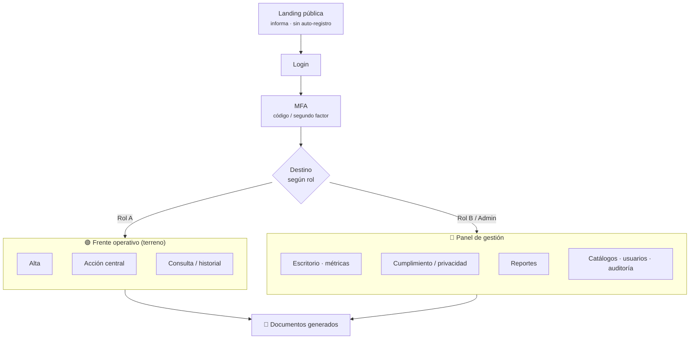
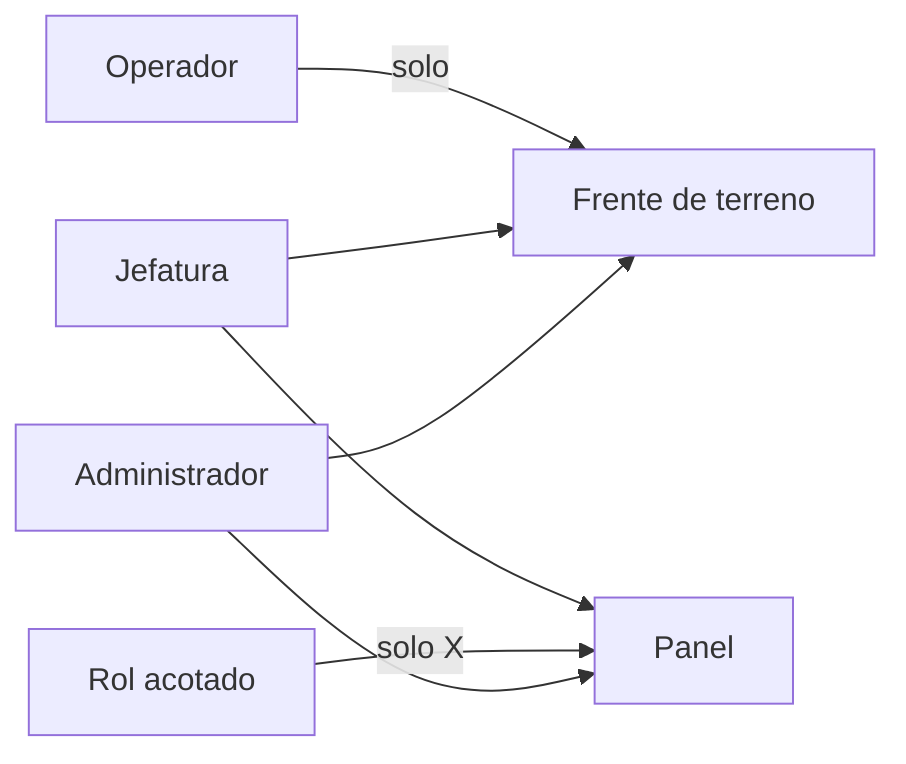
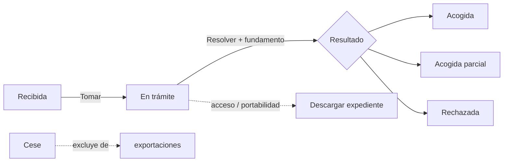

# Plantillas del mapa visual (Mermaid + shell del artifact)

Copia-pega. Los cinco diagramas y el HTML que los envuelve, probados en artifacts (Mermaid
se renderiza nativo con `<pre class="mermaid">`). Reglas: **una figura, una afirmación**;
**etiqueta cada flecha**; el detalle largo va al pack, no al dibujo. Los nodos llevan su
propio color de fondo (tintes claros con texto oscuro) para que se lean sobre cualquier
tema de la página.

## Paleta de clases (misma en los 5 diagramas)

```
classDef vecino  fill:#e0e7ff,stroke:#3730a3,color:#1e1b4b;
classDef terreno fill:#ccfbf1,stroke:#0f766e,color:#134e4a;
classDef panel   fill:#dbeafe,stroke:#1e40af,color:#1e3a8a;
classDef pub     fill:#f1f5f9,stroke:#475569,color:#334155;
classDef doc     fill:#fef3c7,stroke:#b45309,color:#7c2d12;
classDef arcop   fill:#ede9fe,stroke:#6d28d9,color:#4c1d95;
classDef rol     fill:#f8fafc,stroke:#334155,color:#0f172a;
classDef ok      fill:#dcfce7,stroke:#15803d,color:#14532d;
classDef no      fill:#fee2e2,stroke:#b91c1c,color:#7f1d1d;
```

Init común (fuente + color de líneas legible en claro/oscuro):
```
%%{init: {'theme':'base','themeVariables':{'fontFamily':'Public Sans, system-ui','fontSize':'14px','lineColor':'#64748b'}}}%%
```

## 1. Recorrido del caso (el hilo principal — va PRIMERO)

Muestra qué le pasa al sujeto, en orden, con la conexión que nadie adivina etiquetada.



## 2. Las capas (acceso → rol enruta → frentes → documentos)



## 3. Roles (quién cae en qué + alcance)


Acompáñalo SIEMPRE de una tabla HTML (rol · entra a · qué hace / qué no). El diagrama da la
silueta; la tabla, el detalle.

## 4. Ciclo de estados (cumplimiento / negocio)



## 5. Documentos

Suele bastar una lista HTML (con borde de color `doc`) en vez de un diagrama; si se quiere
diagrama, un `flowchart LR` de cada fuente → su archivo generado.

---

## Shell del artifact (HTML)

Estructura probada. Página con tokens claro/oscuro; **las tarjetas de diagrama van con fondo
claro fijo** (`--diagram-bg`) para que Mermaid se lea siempre. Identidad institucional
municipal: franja de 7 colores arriba (ver [[identidad_visual_municipal]]), tipografías
`Archivo` (títulos) + `Public Sans` (cuerpo, es la fuente de gobierno).

Esqueleto mínimo (rellenar con las 5 secciones, cada una: kicker + h2 + `.why` + `<figure>`
con `<pre class="mermaid">` dentro de `.scroll` + `<figcaption>` que afirma qué muestra):

```html
<title>SISTEMA · Mapa de Flujos</title>
<link rel="stylesheet" href="https://fonts.googleapis.com/css2?family=Archivo:wght@700;800&family=Public+Sans:wght@400;500;600&display=swap">
<style>
  :root{ --bg:#f4f6fb; --surface:#fff; --ink:#14203a; --ink-soft:#47526b; --line:#dce1ee;
         --azul:#1e3a8a; --diagram-bg:#ffffff; --diagram-line:#e2e8f0; }
  @media (prefers-color-scheme:dark){ :root:not([data-theme="light"]){
     --bg:#0c1120; --surface:#131a2c; --ink:#eef2fb; --ink-soft:#a3adc4; --line:#26304a;
     --azul:#93b4ff; --diagram-bg:#f8fafc; } }
  :root[data-theme="dark"]{ --bg:#0c1120; --surface:#131a2c; --ink:#eef2fb; --ink-soft:#a3adc4;
     --line:#26304a; --azul:#93b4ff; --diagram-bg:#f8fafc; }
  *{box-sizing:border-box} body{margin:0;background:var(--bg);color:var(--ink);
     font-family:"Public Sans",system-ui,sans-serif;line-height:1.6}
  .belt{display:flex;height:6px} .belt span{flex:1}
  .belt span:nth-child(1){background:#1b75bb}.belt span:nth-child(2){background:#39b54a}
  .belt span:nth-child(3){background:#fcb040}.belt span:nth-child(4){background:#f15a29}
  .belt span:nth-child(5){background:#8dc63f}.belt span:nth-child(6){background:#00a99d}
  .belt span:nth-child(7){background:#ec008c}
  .wrap{max-width:1040px;margin:0 auto;padding:0 22px 80px}
  h1{font-family:"Archivo",sans-serif;font-weight:800;font-size:clamp(30px,5vw,46px);
     letter-spacing:-.02em;text-wrap:balance}
  h2{font-family:"Archivo",sans-serif;font-weight:700;font-size:24px;margin:0 0 6px}
  .kicker{font-size:12px;letter-spacing:.14em;text-transform:uppercase;color:var(--azul);font-weight:700}
  .why{color:var(--ink-soft);max-width:72ch}
  figure{margin:0;background:var(--diagram-bg);border:1px solid var(--diagram-line);
     border-radius:16px;padding:22px 18px;box-shadow:0 10px 30px -18px rgba(15,23,42,.35)}
  .scroll{overflow-x:auto} pre.mermaid{margin:0;text-align:center;min-width:520px}
  figcaption{margin-top:14px;padding-top:12px;border-top:1px dashed var(--diagram-line);
     font-size:13.5px;color:#475569;text-align:center}
</style>
<div class="belt" aria-hidden="true"><span></span><span></span><span></span><span></span><span></span><span></span><span></span></div>
<div class="wrap"> … secciones … </div>
```

Notas:
- Publica con `favicon` 🗺️ y un `description` de una línea.
- Cada `<pre class="mermaid">` empieza con el `%%{init…}%%` y termina con los `classDef`.
- `<small>` dentro de las etiquetas de nodo funciona (htmlLabels de Mermaid); úsalo para el
  subtítulo gris de un paso.
- Ancho: envuelve cada diagrama en `.scroll` (overflow-x) para que el cuerpo nunca haga scroll horizontal.
